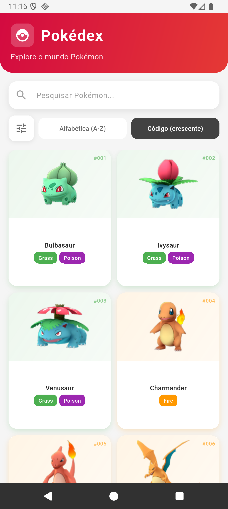
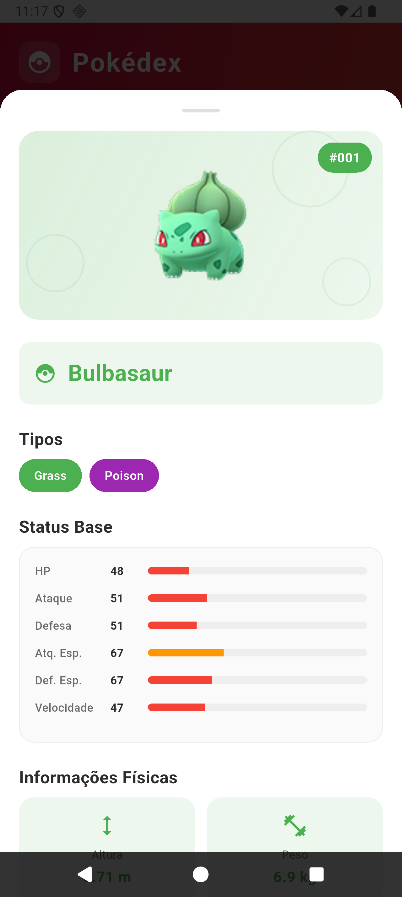
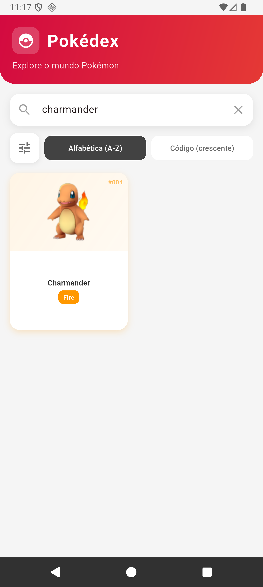

# Poke App

Flutter application that consumes the Pokémon API to display, list, and detail information about creatures quickly and responsively.

## Packages

### Main Dependencies

- connectivity_plus – Real-time internet connectivity check.

- dio – Robust HTTP client for consuming APIs, with interceptors and advanced error handling.

- get_it – Lightweight and decoupled dependency injection.

- go_router – Modern, declarative route management integrated with Navigator 2.0.

### Development Dependencies

- flutter_test – Unit and widget tests.

- flutter_lints – Code standardization and best practices.

- build_runner – Automatic code generation.

- mockito – Creation of mocks for testing.

### State Management

 Uses ChangeNotifier + ListenableBuilder as they are native Flutter solutions, ensuring:

- Reduced coupling to external libraries

- Simplicity

- Easy maintenance

## ScreenShots

| Image 1 | Image 2 | Image 3 |
|----------|----------|----------|
|  |  |  |

## Test and Coverage

flutter pub run build_runner build --delete-conflicting-outputs

flutter test --coverage

genhtml coverage/lcov.info -o coverage/html

open coverage/html/index.html

## License

MIT License

Copyright (c) 2025 William Franco

Permission is hereby granted, free of charge, to any person obtaining a copy
of this software and associated documentation files (the "Software"), to deal
in the Software without restriction, including without limitation the rights
to use, copy, modify, merge, publish, distribute, sublicense, and/or sell
copies of the Software, and to permit persons to whom the Software is
furnished to do so, subject to the following conditions:

The above copyright notice and this permission notice shall be included in all
copies or substantial portions of the Software.

THE SOFTWARE IS PROVIDED "AS IS", WITHOUT WARRANTY OF ANY KIND, EXPRESS OR
IMPLIED, INCLUDING BUT NOT LIMITED TO THE WARRANTIES OF MERCHANTABILITY,
FITNESS FOR A PARTICULAR PURPOSE AND NONINFRINGEMENT. IN NO EVENT SHALL THE
AUTHORS OR COPYRIGHT HOLDERS BE LIABLE FOR ANY CLAIM, DAMAGES OR OTHER
LIABILITY, WHETHER IN AN ACTION OF CONTRACT, TORT OR OTHERWISE, ARISING FROM,
OUT OF OR IN CONNECTION WITH THE SOFTWARE OR THE USE OR OTHER DEALINGS IN THE
SOFTWARE.
