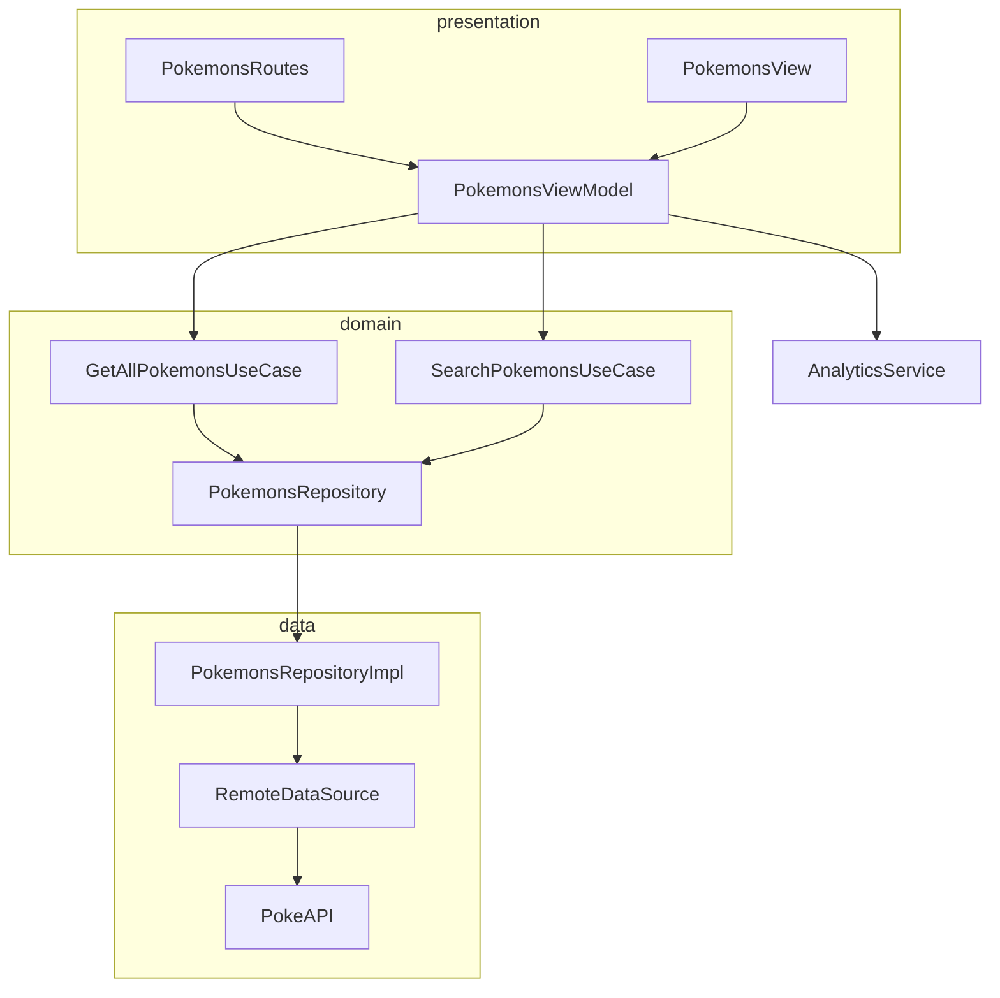
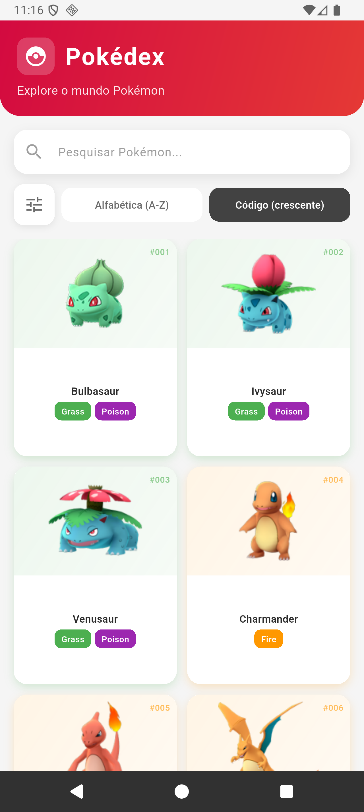
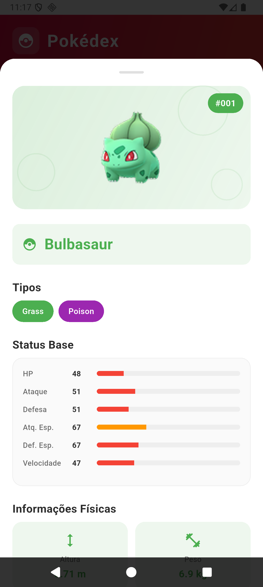
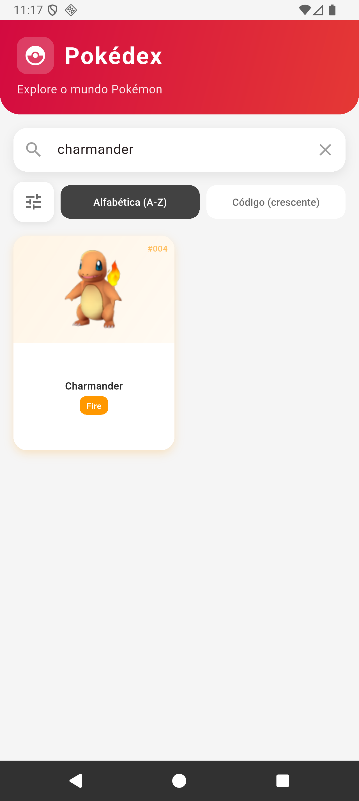

# Poke App

Flutter client for browsing Pokémon from a remote JSON API with list, search, filter, and detail screens.

Domain use cases handle sorting, filtering, and related evolutions; repositories propagate `ResultPattern` outcomes.

Presentation uses view models with `StatePattern` for loading, success, and error UI states.

Native Firebase Analytics on Android logs navigation and errors alongside Dio networking.

Includes layered tests (data sources, repositories, use cases, view models) and CI with analyze and coverage.

## Structure


```mermaid
flowchart TB
  subgraph presentation [presentation]
    PokemonsRoutes --> PokemonsViewModel
    PokemonsView --> PokemonsViewModel
  end
  PokemonsViewModel --> GetAllPokemonsUseCase
  PokemonsViewModel --> SearchPokemonsUseCase
  subgraph domain [domain]
    GetAllPokemonsUseCase --> PokemonsRepositoryPort[PokemonsRepository]
    SearchPokemonsUseCase --> PokemonsRepositoryPort
  end
  subgraph data [data]
    PokemonsRepositoryPort --> PokemonsRepositoryImpl
    PokemonsRepositoryImpl --> RemoteDataSource
    RemoteDataSource --> PokeApi[PokeAPI]
  end
  PokemonsViewModel --> AnalyticsService
```

## Stack

| Technology | Version |
|------------|---------|
| Dart SDK | ^3.13.3 |
| connectivity_plus | ^7.1.1 |
| cupertino_icons | ^1.0.8 |
| dio | ^5.9.2 |
| get_it | ^9.2.1 |
| go_router | ^17.2.3 |
| flutter_lints | ^6.0.0 |
| build_runner | ^2.15.0 |
| mockito | ^5.6.4 |
| Android Gradle Plugin | 9.1.0 |
| Kotlin | 2.4.0 |
| compileSdk / targetSdk | 36 |
| minSdk | 29 |
| JVM | 25 |
| iOS Deployment Target | 15.0 |
| Swift | 5.0 |
| Firebase Analytics | native (Android) |
| GitHub Actions | CI/CD |

## Architecture

```
lib/
    ├── main.dart
    └── src/
        ├── common/
        │   ├── dependency_injectors/
        │   ├── routes/
        │   ├── services/
        │   ├── state_management/
        │   └── widgets/
        └── features/
            └── pokemons/
                ├── data/
                │   ├── data_sources/
                │   ├── models/
                │   └── repositories/
                └── presentation/
                    ├── routes/
                    ├── views/
                    └── widgets/
```

## Coverage

flutter pub run build_runner build --delete-conflicting-outputs

flutter test --coverage

genhtml coverage/lcov.info -o coverage/html

open coverage/html/index.html

## ScreenShots

| Image 1 | Image 2 | Image 3 |
|----------|----------|----------|
|  |  |  |

## Commits

```
git add . && git commit -m ":rocket: Initial commit." && git push
git add . && git commit -m ":building_construction: Added initial project architecture." && git push
git add . && git commit -m ":building_construction: Update project architecture." && git push
git add . && git commit -m ":memo: Updated project documentation." && git push
git add . && git commit -m ":memo: Updated code documentation." && git push
git add . && git commit -m ":white_check_mark: Added feature xyz." && git push
git add . && git commit -m ":wrench: Fixed xyz usage." && git push
git add . && git commit -m ":heavy_minus_sign: Removed xyz." && git push
git add . && git commit -m ":memo: Adjusted project imports." && git push
git add . && git commit -m ":arrow_up: Updated dependencies." && git push
git add . && git commit -m ":arrow_down: Removed dependencies." && git push
git add . && git commit -m ":wastebasket: Removed unused code." && git push
git add . && git commit -m ":test_tube: Added test functionality xyz." && git push
git add . && git commit -m ":construction_worker: Building in progress." && git push
git add . && git commit -m ":construction_worker: Added CI build system." && git push
```

## License

[MIT License](https://opensource.org/licenses/MIT)

Copyright (c) 2026 William Franco.

